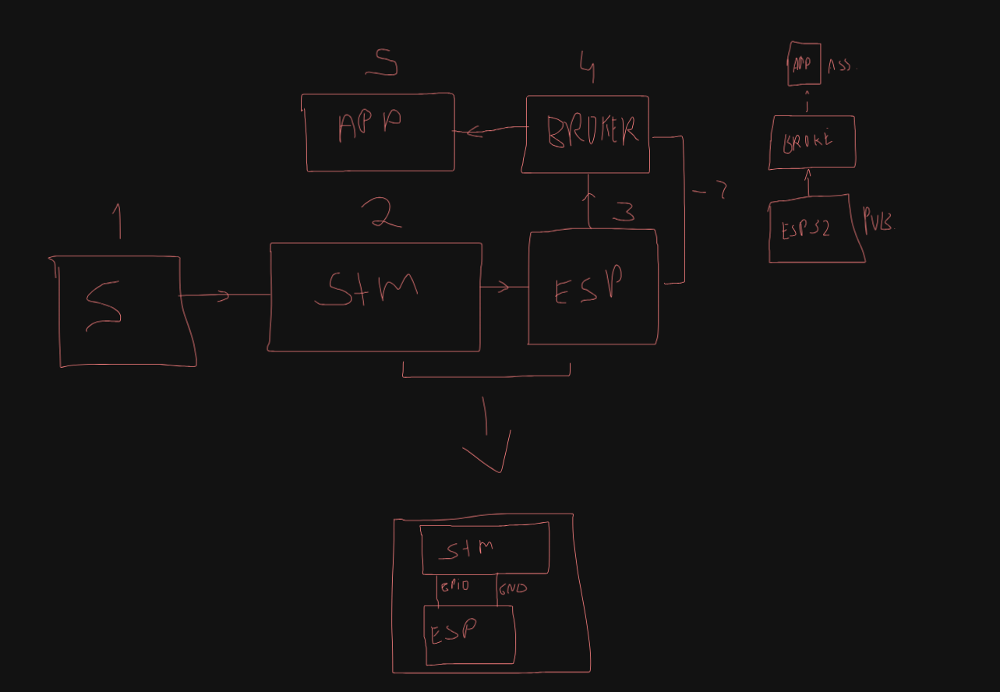
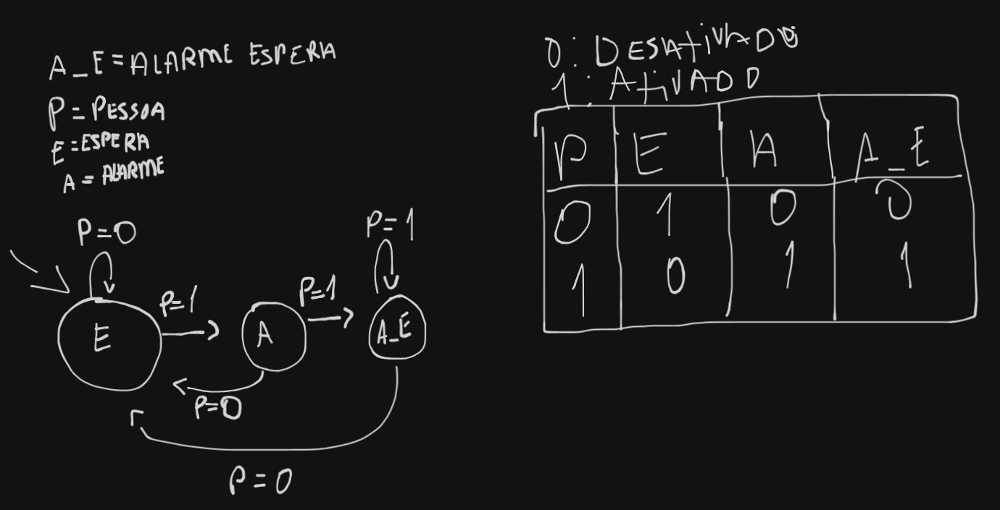

# InfraAlert 🚨

Um sistema inteligente de monitoramento e alerta de infraestrutura que utiliza microcontroladores para detectar anomalias e comunicar eventos em tempo real via MQTT.

## 📋 Descrição do Projeto

InfraAlert é uma solução completa de monitoramento que combina:
- **Sensores embarcados** (ESP32 e STM32F103C8) para detecção de eventos
- **Comunicação em tempo real** via WiFi e MQTT
- **Dashboard web moderno** para visualização e controle
- **Lógica de estado avançada** com FSM (Finite State Machine)

## 🏗️ Arquitetura do Sistema



### Componentes Principais

1. **ESP32 (IoT Gateway)**
   - Conexão WiFi
   - Cliente MQTT (Publisher)
   - Sensores de presença/movimento
   - Conecta-se ao broker MQTT HiveMQ Cloud

2. **STM32F103C8 (Controlador Principal)**
   - Lógica de estado avançada
   - Gerenciamento de alerts
   - Processamento de sinais
   - Implementação do FSM com cooldown

3. **Aplicação Web (React + TypeScript)**
   - Dashboard de monitoramento
   - Visualização de alertas
   - Controle de sistema
   - Interface responsiva com Radix UI

4. **MQTT Broker (HiveMQ Cloud)**
   - Comunicação centralizada
   - Tópico: `infralert/alertas`

## 📁 Estrutura do Projeto

```
InfraAlert/
├── FSM/                          # Diagramas de máquina de estados
│   ├── FSM MICRO.excalidraw     # Arquivo editável
│   └── FSM.png                   # Visualização do FSM
├── sim/                          # Simulações
│   └── test_sim.c               # Simulação do sistema
├── src/
│   ├── firmware/
│   │   ├── esp32_firmware/      # Firmware ESP32
│   │   │   └── src/
│   │   │       └── main.ino     # Código principal ESP32
│   │   └── stm32_firmware/      # Firmware STM32
│   │       ├── Src/
│   │       │   ├── main.c       # Código principal STM32
│   │       │   ├── syscalls.c
│   │       │   └── sysmem.c
│   │       └── F1_Header/       # Cabeçalhos CMSIS e Device
│   └── infralertapp/            # Aplicação web
│       ├── src/
│       │   ├── routes/          # Rotas da aplicação
│       │   ├── components/      # Componentes React
│       │   ├── hooks/           # Custom hooks
│       │   └── lib/             # Utilitários
│       ├── package.json
│       └── vite.config.ts
└── README.md
```

## 🚀 Como Começar

### Pré-requisitos

- **Para ESP32**: Arduino IDE ou PlatformIO
- **Para STM32**: STM32CubeIDE
- **Para Web App**: Node.js 18+, npm ou bun
- **Geral**: Cliente MQTT (opcional, para testes)

### Setup da Aplicação Web

```bash
cd src/infralertapp

# Instalar dependências
npm install
# ou
bun install

# Rodando em desenvolvimento
npm run dev

# Build para produção
npm run build

# Preview do build
npm preview
```

### Configuração ESP32

1. Abra `src/firmware/esp32_firmware/src/main.ino`
2. Configure suas credenciais WiFi:
   ```cpp
   const char* ssid = "sua_rede";
   const char* password = "sua_senha";
   ```
3. Compile e upload para a placa ESP32

### Configuração STM32F103C8

1. Abra o projeto em STM32CubeIDE: `src/firmware/stm32_firmware/`
2. Configure os periféricos conforme necessário
3. Build e flash o código para a placa

## 🔄 Máquina de Estados (FSM)

O sistema utiliza um FSM para gerenciar os estados de detecção e alertas:



### Estados Principais

- **IDLE**: Aguardando detecção
- **DETECTION**: Presença detectada
- **ALERT**: Alerta ativo
- **COOLDOWN**: Período de espera para nova detecção

## 🛠️ Tecnologias Utilizadas

### Hardware
- **ESP32**: Microcontrolador com WiFi
- **STM32F103C8**: Microcontrolador Arm Cortex-M3
- **Sensores**: PIR/Movimento

### Software Frontend
- **React 18**: UI Framework
- **TypeScript**: Type-safe development
- **TanStack Router**: Roteamento moderno
- **TanStack Query**: Gerenciamento de estado
- **Radix UI**: Componentes acessíveis
- **Tailwind CSS**: Estilização
- **Vite**: Build tool

### Backend/Comunicação
- **MQTT**: Protocol de comunicação
- **HiveMQ Cloud**: Broker MQTT
- **Node.js**: Runtime server

## 🧪 Simulação

Para testar a lógica do sistema sem hardware:

```bash
cd sim
gcc -o test_sim test_sim.c
./test_sim
```

## 📊 Scripts Disponíveis

No diretório `src/infralertapp/`:

```bash
npm run dev        # Desenvolvimento com hot-reload
npm run build      # Build otimizado
npm run build:dev  # Build com modo debug
npm run preview    # Preview do build
npm run lint       # Verificar código
npm run format     # Formatar código
```

## 🔐 Segurança

- Comunicação MQTT sobre TLS (porta 8883)
- Credenciais armazenadas de forma segura
- Certificado SSL/TLS habilitado no ESP32

## 📝 Contribuindo

Este projeto faz parte de um trabalho acadêmico/prototipagem. Para sugestões ou melhorias, entre em contato.

## 📄 Licença

Este projeto é para fins educacionais e de pesquisa.

---

**Última atualização**: 2026-06-26